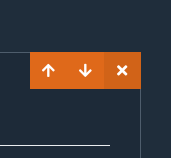

# CodeBook

A web and command-line tool built with React and Node.js that allows developers and educators to create and organize documentation complete with working code examples. It features live transpilation of code, enabling users to run the examples directly in their browser and write their own code. Users can also save their documentation for later use.

It was built using the following technologies:

 - [React](https://reactjs.org/)
 - [Redux](https://redux.js.org/)
 - [Node](https://nodejs.org/en/)
 - [WebAssembly](https://webassembly.org/)
 - [Lerna](https://lerna.js.org/)
 - [Commander](https://github.com/tj/commander.js)

## Online Demo

Try an online demo of CodeBook - [Link](https://magenta-snickerdoodle-92a520.netlify.app)

<i>Online Demo does not have Data Persistence functionality enabled.</i>

---

## Tutorial

Upon opening CodeBook, you will presented with an empty file, and two options:

These buttons allow you to added either a "Code" or "Text" Snippet:

Clicking "Text" will add a Markdown editor snippet, which starts off in view mode:

Clicking on it will enable editing mode, where you can enter Markdown syntax.

<!--  -->

Clicking away from the snippet will change it back to view mode.

Clicking "Code" will add a Code Editor snippet, which presents both a code editor and browser preview.

The "Format" button will allow you to format your code, which can often get cluttered when writing a large amount.

<!--  -->
<!--  -->

CodeBook allows you to import external libraries, like React, and render the results in the browser preview.

However, CodeBook was built to work with React primarily, and will download both the "react" and "react-dom" libraries by default. To help with this the "show()" helper method has been added to allow you to render code without having to write out complex display logic.

Context can be shared across code snippets, however variables and methods have to be declared in a previous snippet in order to be shared to later snippets. Here is an example of a React component being rendered, and then referenced again in the next snippet.

<!--  -->

CodeBook will also display any errors during transpilation or compilation.

Each snippet has several controls, the up/down arrows allow you to reposition each snippet, and the cross allows you to delete a snippet.

<!--  -->
<!--  -->
<!--  -->

---

## CodeBook CLI

### Getting Started

To run the CodeBook CLI, the following command can be run from your terminal:

    npx @code-book-js/cli serve

This will create a <b>notebook.js</b> file in the directory you run it, so please run it within a directory you want to save your CodeBook files in.

### Opening/Saving to a New File

To create a new file, or open an existing one, specify the filename when running <b>serve</b>:

    npx @code-book-js/cli serve newFile.js

### Changing Ports

By default the CLI will run CodeBook on http://localhost:4005, in order to change the port, use the <b>-p</b> flag and specify a port to run on:

    npx @code-book-js/cli serve -p 4006

When first running the CLI, you will be asked to install the CLI onto your computer, enter "y" to proceed:

You will be prompted with a URL to view CodeBook in the browser:

---

## CodeBook Source

### Getting Started

CodeBook uses [Lerna](https://lerna.js.org/) to manage each package.

Make sure Node.js is installed, and npm is up to date:

    npm@latest -g

<i>Due to several package version conflicts, we need to install the NPM packages for the local-client using the <b>--force</b> flag</i>.

<i>This will be fixed in a future version.</i>

Navigate to the local-client project from within the root project directory:

    cd code-book\packages\local-client\

Run the NPM install command with the <b>--force</b> flag:

    npm install --force

Make sure to navigate back to the root project directory before continuing.

Run the provided setup script:

    npm run setup

This will run two Lerna commands:

- <b>bootstrap</b> - Installs all NPM package for each project.
- <b>link</b> - Sets up links to local project dependencies.

You now have everything ready to run locally.

Run the local-api and local-client projects using the following:

    lerna run start

Navigate to the <b>dist</b>directory in the cli project:

    cd packages\cli\dist\

Run the following command to run the cli:

    node index.js serve

This will create a <b>notebook.js</b> file within the <b>dist</b> directory.

If you wish to save or open another file, specify the filename when running the <b>serve</b> command:

    node index.js serve newFile.js

Again a different port can also be specified:

    node index.js serve -p 4006

---

## Contact

Feel free to find and contact me at the following:

